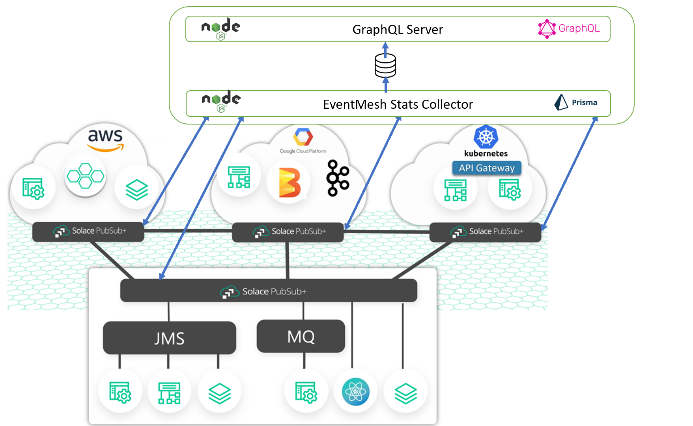

# Event-Mesh-GraphQL



This project is a demonstration of how to take advantage of GraphQL to answer questions about the characteristics of your Solace Event Mesh. There are two components to this project:

  * collector - The app uses the [Solace SEMP  v2](https://docs.solace.com/API-Developer-Online-Ref-Documentation/swagger-ui/action/index.html) API to scrape metrics off all the nodes of the event-mesh and inserts it into a database
  * graphql-server - A GraphQL server that runs on top of the database that the collector node writes to

## Setup

To run this application, you will have to install dependencies and enter configuration using the following steps:

* Run `npm install` to install the dependencies
* Run `npx prisma migrate dev --preview-feature` to generate the local prisma SQL-Lite database
* Run `npm run generate` to generate the GraphQL typescript bindings for the schema
* Run `npm run setup-config` to setup a config file for the collector.  
* (Optional) Run `npx prisma studio` to launch the prisma studio to run queries against the database
* (Optional) Download the [Altair GraphQL GUI](https://altair.sirmuel.design/) to run queries against your GraphQL server


## Running the application

Perform the following steps to run the application.

1. Modify `event-mesh-collector/event-mesh-nodes-config.ts` with the SEMP URL/configs for every node in your event mesh

2. Start the collector process by running `npm run collector`. This will begin polling the various nodes in the broker and storing the results in a local SQLLite database

3. Start the GraphQL server by running `npm run graphql-server`. This will launch a GraphQL server on port 4000

## Sample queries

Currently, the collector only stores clients/subscription information. The following are some of the questions can be answered using GraphQL queries:


* **Which node is my topic subscribed to from?** 
  ```
  query{
  findClientsForSubscription(topicString: "my/topic")
  {
    subscription
    clients {
      nodeName
    }
  }
  }
  ```
  Sample respoonse:
  ```
  {
  "data": {
    "findClientsForSubscription": [
      {
        "subscription": "car/drive",
        "clients": [
          {
            "nodeName": "Cloud Broker"
          },
          {
            "nodeName": "Local Broker"
          }
        ]
      }
    ]
   }
  } 
  ```

* **Which user and node is my topic subscribed to from?**
  ```
  Query{
  findClientsForSubscription(topicString: "car/drive"){
    subscription
    clients {
      nodeName
      userName
    }
  }
  }
  ```
  Sample response:
  ```
  {
  "data": {
    "findClientsForSubscription": [
      {
        "subscription": "car/drive",
        "clients": [
          {
            "nodeName": "Cloud Broker",
            "userName": "local-user"
          },
          {
            "nodeName": "Local Broker",
            "userName": "default"
          }
        ]
      }
    ]
  }
  }
  ```


## Ideas for other functionality

By extending this framework/implementation you can build an extensible API that gives you complete visibility into your event mesh. With more enhancements, here are examples of the other questions that can be answered for your event mesh: 

* ***What nodes have a certain subscription?***
* ***Which clients are exhibiting loss/discards?***
* ***What nodes have the most amount of connected clients on them?***
* ***Which DMR links are being heavily used?***
  

If you had other ideas about questions you'd like to get answered about your event mesh, feel free to raise a PR,


